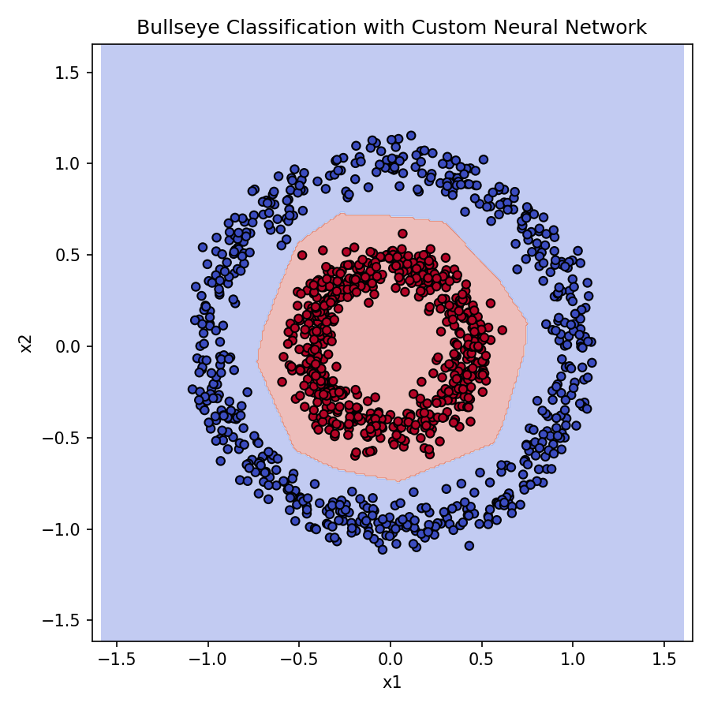

# Neural Network From Scratch

A minimal, fully custom neural network implementation built with NumPy.  
This project was created to understand and reproduce the core mechanics of forward propagation, backpropagation, and training using gradient descent.  
The package will also used inside my NBA game prediction project as the primary model, and was built with that purpose in mind.

## Features

- Fully connected feedforward architecture  
- ReLU and Sigmoid activation functions  
- Binary cross-entropy loss  
- Gradient-based training with minibatch support  
- Evaluation utilities (accuracy, precision, recall, F1)  
- Simple and extensible design  

## Usage Example (Binary Classification)

```python
from nn.model import NeuralNetwork

nn = NeuralNetwork(
    layers=[2, 32, 16, 1],
    lr=0.001,
    batch_size=32
)

nn.fit(X_train, y_train, epochs=200)
predictions = nn.predict(X_test)
```

## Demo

The repository includes a demonstration script (`demo.py`) showing how the model adapts to non-linear classification tasks.  
The resulting visualization is saved as `circles_decision_boundary.png`.

You can view the generated plot here:



## Performance on Historical NBA Game Data

To benchmark the neural network against traditional machine-learning models, every method was trained on NBA regular season games from the 2015–2016 season through December 31, 2023.
All games played on or after January 1st, 2024 of season 2023-24 and the 2024-25 season were held out as the validation set.
This split provides a realistic forward-looking evaluation and avoids data leakage across seasons.

The table below summarizes the performance of five different models across standard classification metrics.

### Model Comparison

| Model | Parameters | Accuracy | Precision | Recall | F1 Score | ROC-AUC |
|-------|------------|----------|-----------|---------|----------|---------|
| Logistic Regression | max_iter=1000 | 0.6543 | 0.6477 | 0.7866 | 0.7104 | 0.6430 |
| Random Forest | n_estimators=300, max_depth=12 | 0.6471 | 0.6364 | 0.8064 | 0.7114 | 0.6336 |
| XGBoost | 400 trees, lr=0.03 | 0.6436 | 0.6453 | 0.7526 | 0.6949 | 0.6343 |
| LightGBM | 400 trees, lr=0.03, leaves=31 | 0.6426 | 0.6409 | 0.7668 | 0.6982 | 0.6320 |
| Custom Neural Network | layers=[input,64,32,1], lr=0.001, epochs=40 | 0.6456 | 0.6320 | 0.8206 | 0.7141 | 0.6307 |

### Summary

As we can see, the custom neural network is able to complete with the other ready made machine learning models, and achieving the highest recall, which shows that its predictions are a little agressive for home wins.
